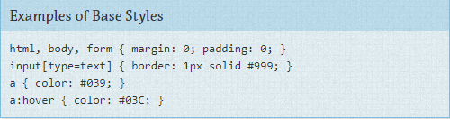
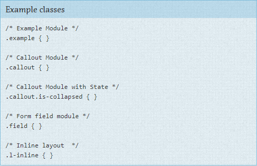

**Categorizando as regras do CSS**

Todo projeto precisa de alguma organização. Acrescentar cada estilo novo que você cria ao final de um arquivo único vai tornar bem difícil de encontrar coisas e será bem confuso para qualquer pessoa trabalhando no projeto. É claro que você já deve ter algum tipo de organização. Eu espero que o que você irá ler nessas páginas irá destacar o que já funciona com o seu projeto, e se eu tiver sorte você irá aprender novas maneiras de melhorar o seu processo.

Como você decide se vai usar IDs, classes ou qualquer outro seletor que você tem à disposição? Como você decide quais elementos devem receber o estilo que você irá criar? Como você faz para facilitar a compreensão de como o seu site e seu CSS está organizado?

O ponto central do SMACSS é a categorização. Ao categorizar as regras do CSS, nós começamos a perceber padrões e definir boas práticas para cada um desses padrões.

Há cinco tipos de categorias:
1. Base
2. Layout
3. Modulo
4. Estado
5. Tema

Nós muitas vezes misturamos os estilos de cada uma dessas categorias. Se estivermos mais cientes de 'o quê' iremos estilizar, poderemos evitar a complexidade que se cria ao entrelaçar essa regras. 

Para cada categoria existem algumas orientações que devem ser aplicadas. Essas separações, de certa forma sucintas, nos permitem fazer alguns questionamentos durante o processo de desenvolvimento. Como iremos codar determinada coisa e porquê iremos codá-la desse jeito?

Uma boa parte do propósito de categorizar as coisas é identificar padrões que se repetem no nosso design. Repetição resulta em menos código, manutenção mais fácil, e maior consistência na experiência do usuário. Você só tem a ganhar. Algumas exceções à regra até podem trazer vantagem mas devem ser justificadas.

**Regras de Base** são os padrões. Elas são quase que exclusivamente seletores de elementos únicos mas podem incluir seletores de atributo, pseudo-seletores, child-selectors ou sibling selectors. Essencialmente, o que um estilo de Base quer dizer é que não importa onde esse elemento apareça ele irá parecer da mesma forma.

**Regras de Layout** dividem a página em seções. Um Layout engloba um ou mais Módulos.

**Módulos** são as partes reutilizáveis e modulares do seu design. São as seções de links, a barra lateral, a lista de produtos e assim por diante.

**Regras de Estado** são maneiras de descrever como os seus Módulos ou Layouts irão parecer em um determinado Estado. O item está escondido ou expandido? Está ativo ou inativo? Regras de Estado descrevem como o seu Módulo irá parecer em telas pequenas ou grandes. Elas também são formas de descrever como o seu Módulo irá parecer em views diferentes como a Home ou uma página interna.

E finalmente, **regras de Tema** são similares as regras de Estado pois elas descrevem como Módulos e Layouts devem se parecer. A maioria dos sites não precisam de uma camada de tema, mas é bom saber que ela existe.

**Regras de nomeação** 

Ao separar as regras em 5 categorias, usar uma conveção de nomes é bom para entender imediatamente à qual categoria um estilo pertence e o seu papel no scopo da página. Em projetos grandes, é mais comum ter os estilos divididos em diversos arquivos. Nesses casos, as convenções de nomes também facilitam saber em qual arquivo um estilo se encontra.

Eu gosto de usar um prefixo para diferenciar entre regras de Layout, Estado, ou Módulo. Para leyout eu uso `l-` mas `layout-` também funciona. Usar prefixos como `grid-` também ajudam a separar estilos de Layout dos outros estilos com mais clareza. Para regras de Estado eu gosto de `is-` como por exemplo em `is-hidden` ou `is-collapsed`. Isso ajuda a descrever as coisas de uma maneira fácil de ler.

Os Módulos serão a maior parte de qualquer projeto. Por esse motivo, se cada módulo tivesse um prefixo `module-` seria desnecessáriamente verboso. Módulos apenas usam o nome do próprio módulo.

Elementos relacionados dentro de um módulo usam o nome base como prefixo. Neste site, os exemplos de código usam `.exm` e as legandas usam `.exm-caption`. Eu posso instantaneamente ver a classe da legenda e perceber que ela está ligada aos exemplos de código e onde encontrar os estilos dela. 

Módulos que são uma variação de outro módulo também devem usar o nome do módulo base como prefixo. Sub-classes são abordadas com mais detalhes no capítulo das regas de Módulos. 

A convenção de nomes será usada nesse livro. Como a maioria das coisas que eu citei aqui, nãos se sinta obrigado a seguir essas regras obrigatoriamente. Faça uma conveção, documente-a, e siga-a fielmente. 