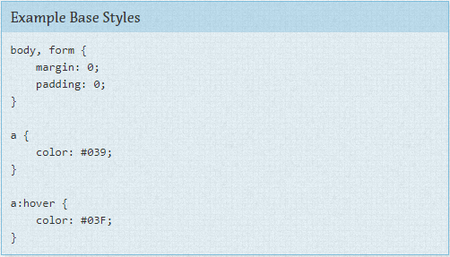

** Regras de Base** 

Uma regra de Base é aplicada ao elemento usando o próprio seletor do elemento, um seletor descendente, um child-selector junto com pseudo-classes. Ela não inclui nenhum seletor de id ou classe. Ela define o estilo padrão de como o elemento deve parecer em todas as páginas.

Estilos de Base inclui configurar tamanho dos títulos, estilo padrão dos links, tamanho padrão das fontes, e background do body. Não há necessidade nenhuma de usar `!important` no estilo Base.

Eu recomendo fortemente que você especifique um background para o body. Alguns usuários definem o seu background do navegador como diferente de branco. Se você apenas esperar que o seu background seja branco o seu site pode parecer quebrado para alguns usuários. Ou pior, a sua cor de fonte pode conflitar com as configurações do usuário e tornar seu site inutilizável. 

** CSS Resets**

Um CSS Reset é um conjunto de estilos de Base desenvolvidos para tirar fora, ou resetar, margem, padding, e outras propriedades padrão. O objetivo disso é construir uma base cross-browser consistente para o desenvolvimento do seu site. 

Muitos frameworks de reset podem ser agressivos demais e introduzir mais problemas do que resolvê-los. Remover margem e padding de elementos para depois adicioná-los novamente gera um esforço dobrado e só aumenta a quantidade de código que será enviada para o cliente. 

Muitos acham estilos de reset uma ferramenta muito útil no desenvolvimento de sites. Apenas certifique-se de saber os contras do framework que você quer usar e planejar de acordo com isso. 

Desenvolver o seu próprio conjunto de regras de Base que você usa consistentemente em todos os projetos também pode ser vantajoso. 