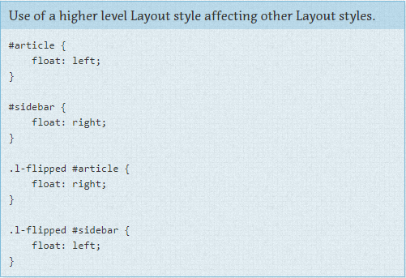
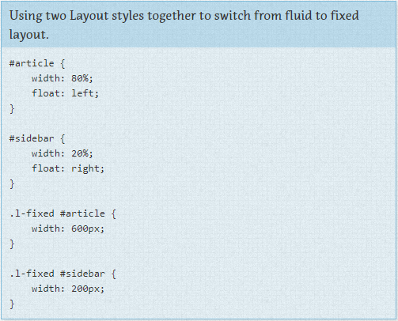

** Regras de Layout ** 

CSS, na sua natureza, é usado para dispor¹ itens em uma página. No entanto há uma diferença entre o Layout ditar os itens maiores ou menos em uma página. Os componentes menores - como um texto explicativo ou um formulário de login, ou um item de navegação - ficam dentro do escopo de itens maiores como um cabeçalho ou um rodapé. 

Estilos de Layout também podem ser divididos em estilos maiores ou menores baseados na sua reutilização. Estilos maiores como cabeçalhos e rodapés são tradicionalmente estilizados usando IDs, mas tire um tempo para pensar em todos os componentes que não comuns em todos os componentes da página e use seletores de classe quando apropriado. 

Alguns sites podem ter a necessidade de uma estrutura de layout mais generalizada. (por exemplo: https://960.gs/). Esses estilos menores de layout usarão nome de classe ao invés de ID para que os estilos possam ser utilizados várias vezes em uma página. 

Geralmente um estilo de layout tem apenas um seletor. Um ID ou uma classe. No entanto, algumas vezes um layout precisa levar em conta diferentes fatores. Por exemplo, você pode ter diferentes layouts de acordo com as preferências do usuários. Essa preferência de layout ainda seria declarada como um estilo de Layout e usada em combinação com outros estilos de Layout.

No exemplo de Layout, a classe `.l-flipped` é aplicada em um elemento de nível superior, como o body e permite que o artigo e o conteúdo da barra lateral sejam trocados, movendo a barra lateral da direita para a esquerda e vice-versa para o artigo.

Nesse exemplo a classe `.l-fixed` modifica o design para mudar de layout fluído (usando porcentagens) para layout fixo (usando pixels).

Notas de rodapé:
1 - A palavra usada no original é Layout que traduzi como dispor (...lay items out on a page...).