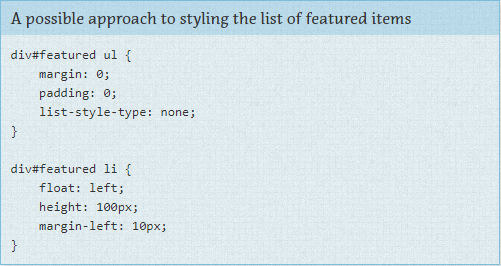

** Regras de Layout ** 

CSS, na sua natureza, é usado para dispor¹ itens em uma página. No entanto há uma diferença entre o Layout ditar os itens maiores ou menos em uma página. Os componentes menores - como um texto explicativo ou um formulário de login, ou um item de navegação - ficam dentro do escopo de itens maiores como um cabeçalho ou um rodapé. 

Estilos de Layout também podem ser divididos em estilos maiores ou menores baseados na sua reutilização. Estilos maiores como cabeçalhos e rodapés são tradicionalmente estilizados usando IDs, mas tire um tempo para pensar em todos os componentes que não comuns em todos os componentes da página e use seletores de classe quando apropriado. 

Alguns sites podem ter a necessidade de uma estrutura de layout mais generalizada. (por exemplo: https://960.gs/). Esses estilos menores de layout usarão nome de classe ao invés de ID para que os estilos possam ser utilizados várias vezes em uma página. 

Geralmente um estilo de layout tem apenas um seletor. Um ID ou uma classe. No entanto, algumas vezes um layout precisa levar em conta diferentes fatores. Por exemplo, você pode ter diferentes layouts de acordo com as preferências do usuários. Essa preferência de layout ainda seria declarada como um estilo de Layout e usada em combinação com outros estilos de Layout.

No exemplo de Layout, a classe `.l-flipped` é aplicada em um elemento de nível superior, como o body e permite que o artigo e o conteúdo da barra lateral sejam trocados, movendo a barra lateral da direita para a esquerda e vice-versa para o artigo.

Nesse exemplo a classe `.l-fixed` modifica o design para mudar de layout fluído (usando porcentagens) para layout fixo (usando pixels).

Outra coisa que você pode notar no exemplo do Layout é a convenção de nomes que eu usei. As declarações que usam seletores de ID estão nomeadas com precisão e sem usar prefixos. Os seletores de classe, no entanto usam um prefixo `l-`. Isso ajuda a identificar facilmente o propósito desses estilos e separá-los de modos e estados. Regras de Layout são a única categoria principal que utiliza seletores de ID, se você decidir que quer usar IDs. Se você quiser colocar prefixos nos seus IDs, você pode, mas não é tão necessário. 

**Usando IDs** 

Para deixar claro, usar IDs no seu HTML pode ser bom e em alguns casos, absolutamente necessário. Por exemplo, eles são ganchos eficientes para o seu Javascript. Para o CSS, no entanto, IDs não são necessários pois a diferença de performance entre ID e classe é quase nula e seu código pode ficar complicado por causa do aumento de especificidade. 

**Exemplos de Layout**

Teoria é uma coisa e prática é outra. Vamos dar uma olhada em um site para entender o que é layout e o que é módulo. 

Ao dar uma olhada no site da CNN, há vários padrões que ocorrem me vários sites. Por exepmlo, há um cabeçalho, uma barra de navegação, uma área de conteúdo e um rodapé (que não aparece na imagem);

No momento que estou escrevendo este texto, este site segue de maneira bem próxima essa divisão e atribui ID para essas seções pricipais. 

Isso foi direto, e eu tenho certeza que você deve estar pensando, "É sério? Você está me ensinando a fazer isso?". Vamos dar uma olhada em outra parte da página. 

Dando uma olhada na seção Featured, vemos um grid com notícias. A marcação HTML que a CNN usa é uma `div` container com `div`s filhas. Eu teria feito isso, provavelmente com uma unordered list (ul). E vamos fazer dessa maneira mesmo. 

Não considerando a abordagem SMACSS, nós talvez iríamos adicionar um ID featured na `div` exterior e então criar os estilos a partir disso. 

Existem alguns pressupostos que fizemos com essa abordagem.

Notas de rodapé:
1 - A palavra usada no original é Layout que traduzi como dispor (...lay items out on a page...).