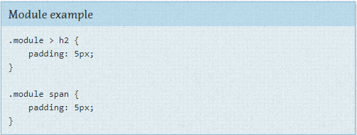

**Regras de módulo**

Como comentado brevemente na seção anterior, um Módulo é um componente mais discreto da página. É a sua barra de navegação, carousel, modal, widgets e assim por diante. Eles são a carne da página. Os módulos se encaixam dentro dos componentes de Layout. Módulos algumas vezes podem se encaixar dentro de outros módulos também. Cada módulo deveria ser planejado para ser um componente autônomo. Dessa maneira a página se torna mais flexiva. Se feito da maneira certa, módulos podem ser facilmente movidos para partes diferentes do layout sem quebrar.

Quando for definir as regras de um módulo, evite usar IDs e seletores de elemento, use apenas classes. Um módulo provavelmente conterá uma série de elementos e provavelmente haverá um desejo de usar seletores descendentes ou secundários para direcionar esses elementos.

**Evite seletores de elemento** 

